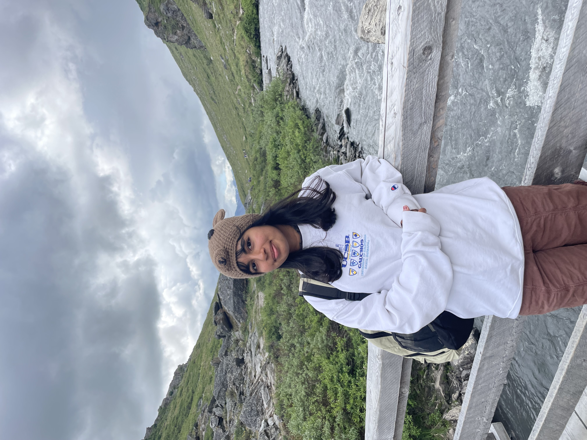

# Team Pancho — Creative Motion Control Course Site

## Team Members

  
  <h3>Taneesha Panda</h3>
  
<em>B.S., Data Science</em>

  
 Taneesha is a fourth-year undergraduate studying Data Science with a minor in Art and Technology. She has been involved in the 4Eyes Lab exploring haptic systems, robotics, and HCI. In this course, she is interested in exploring the space where CNC machines support human intention and creativity, redefining them as instruments you develop a feel for rather than simply operate.

  
  <h3>Benjamin Ancho</h3>
  
<em>B.S., Data Science * B.A., Sociology</em>

  
Benjamin is a second-year undergraduate student studying Data Science and Sociology with minors in Mathematics and Media Art & Design. He has taken two undergraduate MAD classes exploring how technology has changed the way people design. In this course, he is interested in learning how custom CNC machines allow for designs that traditional CNC machines cannot.

<!-- Copy the block above to add more team members -->

## Projects

| Project | Description |
|---------|-------------|
| [Project 1](projects/project1/docs/) | *Brief description of project 1* |

<!-- Add rows as you complete more projects:
| [Project 2](projects/project2/docs/) | *Brief description of project 2* |
| [Project 3](projects/project3/docs/) | *Brief description of project 3* |
-->
