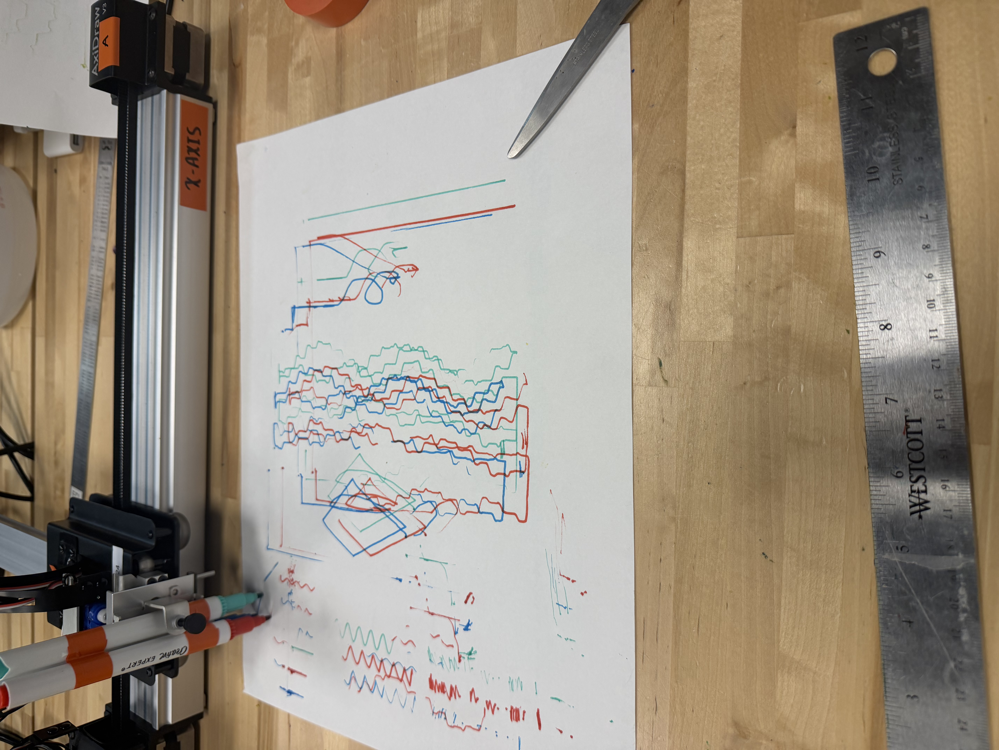
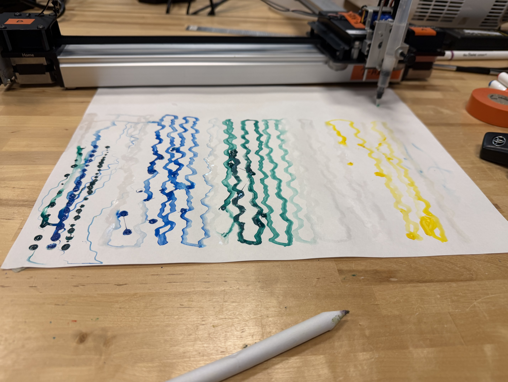
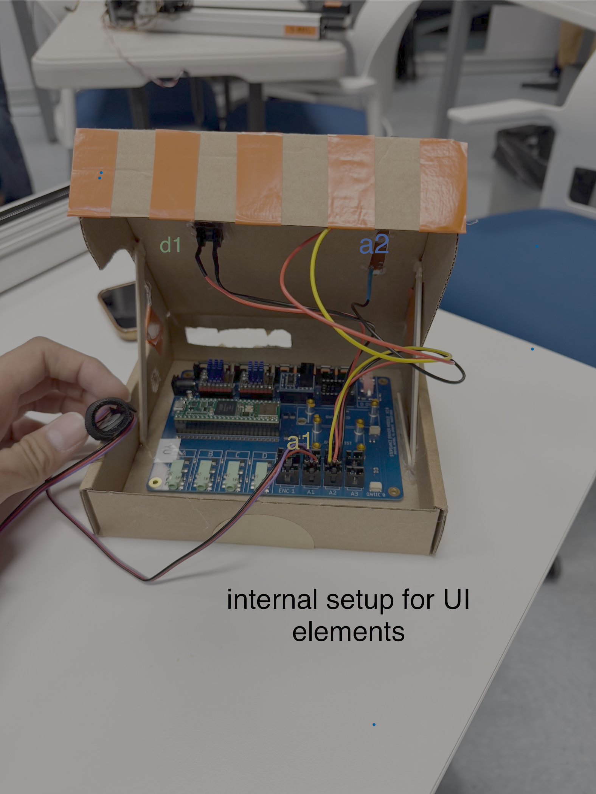
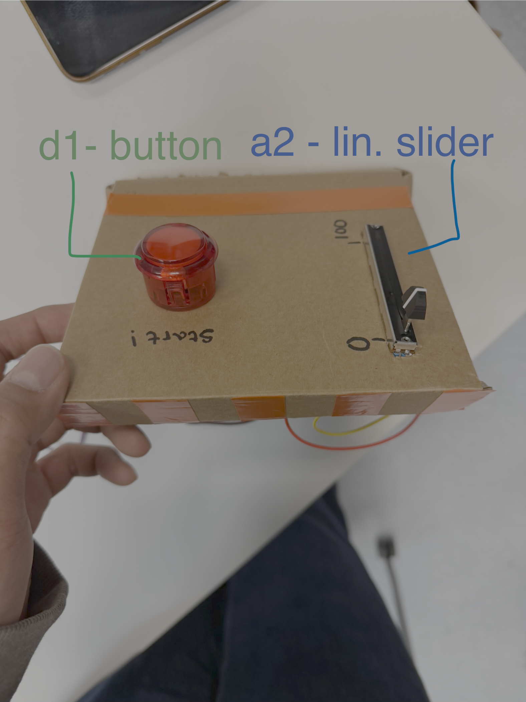

# Project 1: [Vital Lines]

## Concept

Vital Lines is a biometric drawing tool that uses a person's live heartbeat as its primary input. Our concept stems from the liveness dimension of the brief, neither the user nor the machine has full control over the resulting drawing. We took inspiration from “Heartbeat Sasaki", however instead of having an artist as an interpreter of the heartbeat we give it to a mechanical machine where the heart beat is what modifies its geometric design. Upon pressing a button, the machine draws in a zig zag motion across the y axis, with the horizontal amplitude of each line driven by the PulseSensor’s raw voltage signal.  Further, the operator can adjust the scale of the amplitude using a linear potentiometer.

## Design


Our design goal was to visualize pulserate data clearly and that still looks intentional rather . We experimented with various mediums from oil pastel to markers, and decided on using thin watercolor brush pens.

**Finding the right medium**

To achieve this intentional design we knew that the medium that the AxiDraw was using to draw would be crucial to its end result. We knew that we wanted a medium that blended together past strokes as we wanted even the medium we had to be dynamic. 

We first started using oil pastels and a blending brush but found that the axidraw didn't have the necessary pressure for a good blend. 


We then thought about using markers but found that the output of the machine was too mechanical.




We then tried watercolors and found that it was the medium that was perfect for the project. The delicate, fluid nature of watercolor allows the Axidraw to glide smoothly across the page, and the translucency of the marks allows for cleaner layered passes. The brush strokes also soften the mechanical precision of the plotter into something more intimate and organic. 



**Adding another layer of liveness**

We knew that we needed another way for a user to modify the AxiDraw’s output as a heartbeat alone felt like something out of their control.

At first we believed that using a potentiometer to control the x-wave frequency would be the best way for users to modify the output of their heartbeat. However during testing we found that the AxiDraw’s output felt unintuitive and random at times. 

From there we chose to instead create an amplitude sensor as well as a linear potentiometer. Scaling the wave amplitude felt more purposeful when it was drawing and the linear potentiometer solved the problem of it being unintuitive for a user to interact with. The final result preserved the underlying waveform and felt more aesthetically coherent. 


Our iterations of different designs


## Implementation

We started by adapting the z-wave generator from the instructional guide 
A sine wave generator drives the pen's horizontal (X axis) oscillation, producing the heartbeat-like waveform across the page. The amplitude of that oscillation is read in raw ADC values (400-800 Hz) from analog input A1, which is connected to the pulse rate sensor, so as the heartbeat signal fluctuates, the width of the drawn wave responds directly. A second analog input, A2, reads a slider that acts as a multiplier, letting the operator scale the amplitude up or down without overriding the sensor data. A button on the board triggers the Y axis motion, which moves the pen head in a zigzag pattern down the page, stepping across in 10mm increments to lay down successive horizontal passes until the page is filled. We were able to create this zigzag pattern down the page using the queueing system to avoid overlapping commands to the AxiDraw. These components produce a drawing that is live, continuous, and user-adjustable in real time. 

### Hardware Setup

Describe your hardware configuration.





### Code Overview

Highlight key parts of your code and explain your approach:

```cpp
void y_motion() {
  // Moves the header to give more spacing
  queue_xy_target(current_line_x, 10);
  //Creates the zig-zag pattern
  for (int i = 0; i < 10; i++) {
    queue_xy_target(current_line_x, 190);
    current_line_x += 10;
    queue_xy_target(current_line_x, 190);
    queue_xy_target(current_line_x, 10);
    current_line_x += 10;
    queue_xy_target(current_line_x, 10);
  }
}
```

```cpp
  // Multiplys heartbeat (A1) by slider (A2) to get final amplitude
  // Makes it so the amplitude only changes when button is pushed
  if (begin) { 
  float32_t heartbeat_val = analog_a1.read();
  float32_t multiplier = analog_a2.read();
  x_wave_gen.amplitude = heartbeat_val * multiplier;
  }

```

## Results

Show your project in action. Embed a video of it working:

<iframe width="560" height="315" src="https://youtube.com/embed/fSsLYvdi7ws" frameborder="0" allowfullscreen></iframe>

<!--
<video width="560" controls>
  <source src="assets/demo-video.mp4" type="video/mp4">
</video>
-->

## Reflection

Over the course of project 1, we came to appreciate how finicky embedded hardware can be. Small issues with wiring or timing the configuration would produce unexpected problems, so we became more attuned to how the system operates at a low level. What we found especially challenging was how the platform exports code and how we had to change our thought process from something like python into something more like javascript.
We also learned how to configure the analog pulserate sensor and understand how the signal mapped onto the Stepdance waveform generator.

For the next iteration, we could revisit oil pastel underpainting by increasing the pressure of the blending stick at the point of contact to see how it interacts with the pre-laid pastel. We could also add more UI elements for the users to control more aspects of their drawing, as well as making how the lines are modified more intuitive to new users.  We experimented a lot with the visual arrangement and art style however we believe that changing how AxiDraw’s modifiers and mediums would unlock a new aesthetic potential for this system

