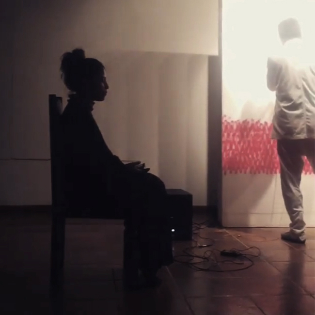
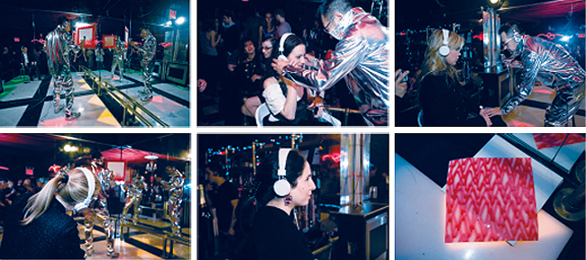

# Project 1 Proposal

## Vital Lines: Our "Live" Plotter

## Idea

Inspired by the "liveness" dimension of this project, we decided to take that principle literally by working with biometric data — one's heartbeat in particular. Users wear a pulse-rate sensor and the AxiDraw translates the live waveform data into a slowly accumulating line drawing. The finished result simultaneously resembles a medical ECG readout and a deeply personal portrait of the body's internal rhythm.

## Inspiration

Our inspiration starts with Heartbeat Drawing Sasaki. His process involves attaching a pulse sensor to a participant, playing their heartbeat aloud through a speaker, and drawing the audible waveform by hand. Our project occupies a similar space, incorporating CNC automation as the machine draws from live biological data, while the operator shapes the output through adjustable parameters.

Other references:
- Mesel Isaac's HeartBot: an installation where viewers place their finger on a heart rate sensor and a machine creates a drawing of dots and waves in response to their live heartbeat, with the cumulative result of 60 different people's interactions building up on a single canvas
- BioMECI is an organization working at the intersection of biology, media, and creative inquiry; their projects demonstrate the expressive potential of biometric data as an artistic medium

## Proposed Design

The machine draws in horizontal passes across the page, with the amplitude of each line driven by live pulse data. Users can adjust parameters on the Stepdance module board to control drawing speed and line density. We also plan to experiment with layering passes and different drawing media. The goal is essentially shaping the aesthetic character of the output without overriding the heartbeat data itself. 

## Planned Implementation

Pulse reader → Arduino for sensor output + pass values over serial → run Stepdance → map to AxiDraw motion parameters

## Major Challenges / Questions

How do we handle lag and noise in the continuous signal (rather than just a discrete BPM integer) in order to pass it into Stepdance?

## Materials Required
* Pulse reader/heartrate sensor
* Experimental art mediums