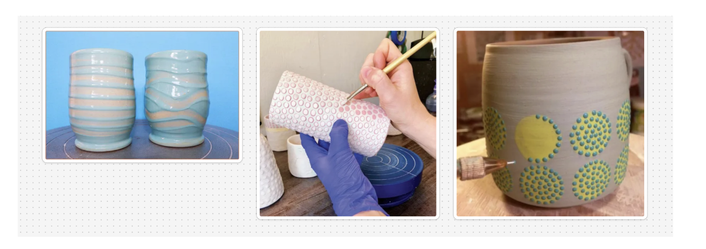

# Project 2 Proposal: Geometric Glaze Application for Ceramics
## Creative Domain
The final artifacts we are aiming for are highly geometric designs on glazed pieces. We plan to accomplish this goal by modifying an Ender 3D printer and creating custom hardware that uses polar coordinates to produce these highly geometric glaze designs. Our goal is to help ceramists experiment with and reproduce these labor-intensive designs.

Our inspiration for these geometric designs comes from techniques such as slip dotting and stencil design, where ceramists have to dedicate long hours to achieve precise, geometric results.

We envision that ceramists would use this tool after they have already designed their bisque ware piece. The skills preserved in creating these artifacts would be: centering the object on a throwing bat, creating the shape in ceramics, trimming the shape, firing, and general glazing techniques. It is assumed that the user knows how to dip the piece in transparent glaze afterwards.

The processes that this tool extends are: slip dotting, repetition, geometry, radial symmetry, high-frequency mark-making, and large-scale production.

## Technical Development
Our objective falls under Method B: modifying an existing machine. We plan on adding a motorized rotating wheelhead axis to a modified Ender 3D printer. We plan to use polar coordinates rather than Cartesian coordinates because we believe that this coordinate system best suits our goal. Another reason we plan to use a rotating wheelhead is that it makes it easier for practitioners to map how their work can be applied on this machine.

The following is a reference for how we plan to modify the Ender 3D printer.
<iframe width="560" height="315" src="https://www.youtube.com/embed/VEgwnhLHy3g?si=kPUBWL1E8rJZJyKE" title="YouTube video player" frameborder="0" allow="accelerometer; autoplay; clipboard-write; encrypted-media; gyroscope; picture-in-picture; web-share" referrerpolicy="strict-origin-when-cross-origin" allowfullscreen></iframe>

The workflow we envision is as follows: once the artifact has been bisque fired, the ceramist would center the piece on the wheelhead. They would then prepare the machine by zeroing the axes, testing the viscosity of the slip glaze, and loading the glaze into the toolhead. Next, they would hone the flow rate of the machine using a potentiometer so that an appropriate amount of glaze is dispensed. The artist would then specify the pattern by using a potentiometer to set the spacing of the design. They would use encoders to fine-tune the height and depth of the toolhead relative to the piece. They would also use a slider to control the speed at which the wheelhead rotates. We believe that this workflow allows for the most control, so that a person can reasonably glaze a variety of bisque ware shapes with different materials and sizes.

## Software

We envision utilizing StepDance to develop this interaction with the following parameters:

- Dot Frequency: a wave generator sets how often the applicator fires per rotation and controls the density of the pattern

- Flow Rate: a syringe extruder controls glaze which can be tuned

- Wheel Speed: rpm of rotating wheelhead →ideally this is synced to dot frequency 

- Brush vector: position of applicator head, set height and distance from ceramic surface

- Design spacing: an encoder controls the angle of brush vector'

Our envisioned example would be the following:
A person who wants to create a dotted design on a simple cylindrical bisqueared piece would center the object on the wheelhead. Fill the glaze applicator with the appropriate viscosity of glaze. Hone the brush head to the ceramic piece. Make sure that the frequency of the wave and the speed of the wheel is appropriate for said frequency. And then a rate of flow of the glaze to the ceramic piece.

## Components

We envision that the following would be the components that we would need to create the machine and artifacts

DC Motor

Belt for DC Motor

Wheelhead

Ender 3D Printer

Servo Motor

Screwhead delivery system with a syringe

Ceramic pieces

Slip and Glaze

Kiln

## Questions

Glaze pressure & non-Newtonian behavior: navigating consistent dot size requires careful syringe pressure calibration 

Usability issues; setting the applicator to start, defining patterns, limits, should all be easy to navigate and avoid CAD-CAM-CNC workflow.

What would be a good formula to create the right viscosity and proportion of slip to glaze to make a geometric design with our machine?
