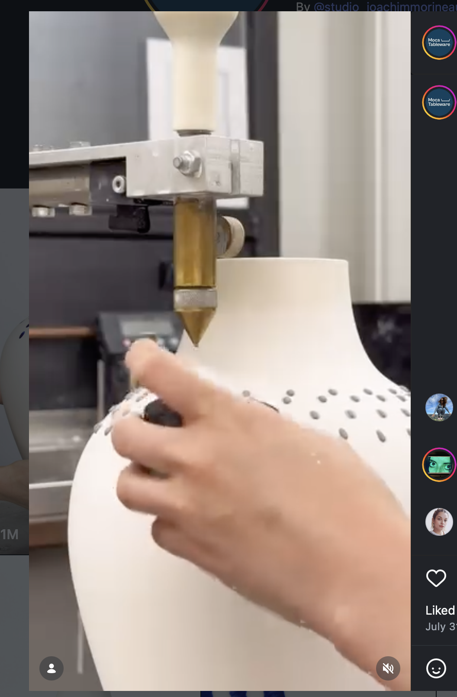
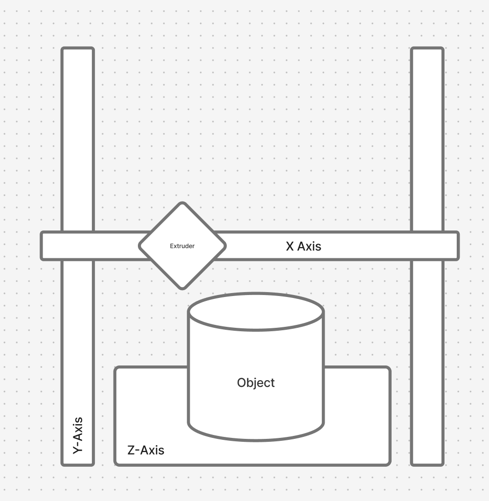

# Project 2 Proposal: Geometric Glaze Application for Ceramics

## Creative Domain

The final artifacts we are aiming for are highly geometric designs on glazed pieces. We plan to accomplish this goal by modifying an Ender 3D printer and creating custom hardware that uses polar coordinates to produce these highly geometric glaze designs. Our goal is to help ceramists experiment with and reproduce these labor-intensive designs.

Our inspiration for these geometric designs comes from techniques such as slip dotting and stencil design, where ceramists have to dedicate long hours to achieve precise, geometric results. We envision that ceramists would use this tool after they have already designed their bisqueware piece. The skills preserved in creating these artifacts would be: 

- centering the object on a throwing bat
- creating the shape in ceramics
- trimming the shape
- firing and basic glazing techniques

The processes that this tool extends are: 

- slip dotting
- repetition
- geometry
- radial symmetry
- large-scale production

## Technical Development

Our objective falls under Method B: modifying an existing machine. We plan on modifying an Ender 3d printer specifically its extrusion so that it would be able to dispense a slip glaze using polar coordinates

The following is a reference to how the slip would be applied to the vessel

The workflow we envision is as follows: once the artifact has been bisque fired, the ceramist would center the piece on a bat and then center the bat onto the Ender 3D printer. They would then prepare the machine by zeroing the axes, testing the viscosity of the slip glaze, and loading the glaze into the toolhead. Next, they would hone the flow rate of the machine using a potentiometer so that an appropriate amount of glaze is dispensed for their piece. The artist would then specify the pattern by using a potentiometer to set the spacing of the design. They would use encoders to fine-tune position of the toolhead relative to the piece. We believe that this workflow allows for the most control, so that a person can reasonably glaze a variety of bisqueware shapes with different materials and sizes.

The following is how we envision the machine

Our project timeline would be 

1. Testing glaze formula and extrusion
2. Attaching syringe toolhead to Ender
3. Testing on flat ceramic tiles
4. Testing on tapered ceramic pieces

## Software

We envision utilizing StepDance to develop this interaction with the following parameters:

- **Dot Frequency**: a wave generator sets how often the applicator fires per rotation and controls the density of the pattern

- **Flow Rate**: a syringe extruder controls glaze which can be tuned

- **Brush vector**: position of applicator head, set height and distance from ceramic surface

Our envisioned example would be the following:
A person who wants to create a dotted design on a simple tapered bisqueware piece would center the object on the bat and then onto the ender’s bed. Fill the glaze applicator with the appropriate viscosity of glaze. Hone the brush head to the ceramic piece. Make sure that the frequency of the wave and the speed of the wheel is appropriate for said frequency. And then a rate of flow of the glaze to the ceramic piece.

## Components

We envision that the following would be the components that we would need to create the machine and artifacts

- Ender 3D Printer

- Syringe based extrusion

- Ceramic pieces

- Slip and Glaze

- Kiln

- Stepper Motor

## Questions

Glaze pressure & Slip formulation: navigating consistent dot size requires careful syringe pressure calibration and reliable glaze slip formula

Usability issues; setting the applicator to start, defining patterns, limits

Creating the toolhead for application

Centering the ceramic piece onto the ender’s bed

|-------------|

## Status Update - May 21 2026:

**Completed**
Step 1. Glaze Formula & Extrusion Testing
We tested and validated the glaze slip formula, confirming a viscosity suitable for syringe-based extrusion

Syringe Toolhead Design & Fabrication
We designed a custom syringe extrusion mechanism in Fusion 360, fully fabricated and assembled the tool. This component mounts to the Ender and controls glaze dispensing.

**In Progress**

Step 2. Mounting Toolhead to Ender
The syringe toolhead needs to be mounted to the Ender 3D printer. The assembly should be mechanically stable and positioned correctly relative to the print bed for ceramic surface application.

Step 3. Programming Geometric Patterns
We are currently developing the software to drive the Ender in geometric glaze patterns. Our approach uses a circle wave generator to produce radially symmetric dot patterns, translating wave frequency parameters into coordinated XY and extrusion motion. 

**Next Steps**
- Testing the programmed patterns on flat ceramic tiles
- Iterating on pattern density and flow rate based on tile results
- Moving to tapered bisqueware pieces once flat-tile tests are stable