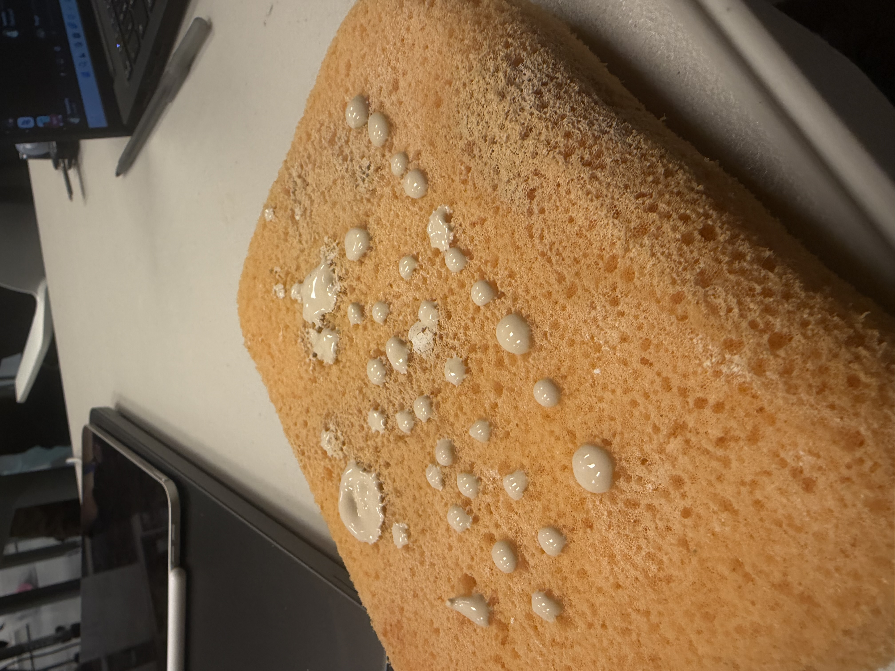
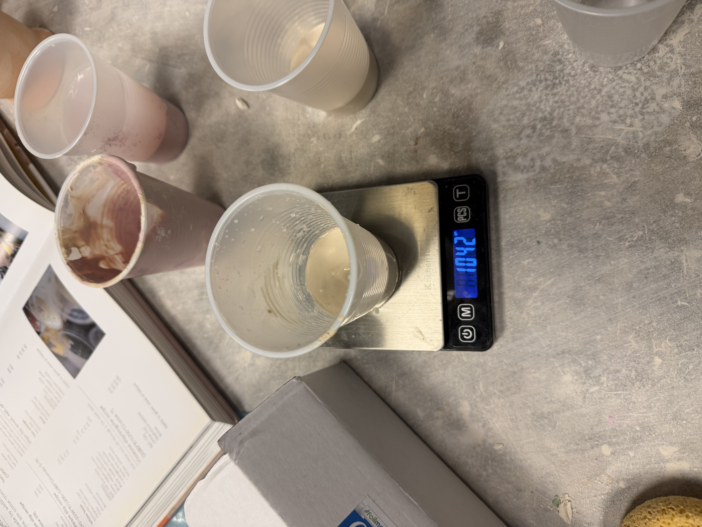
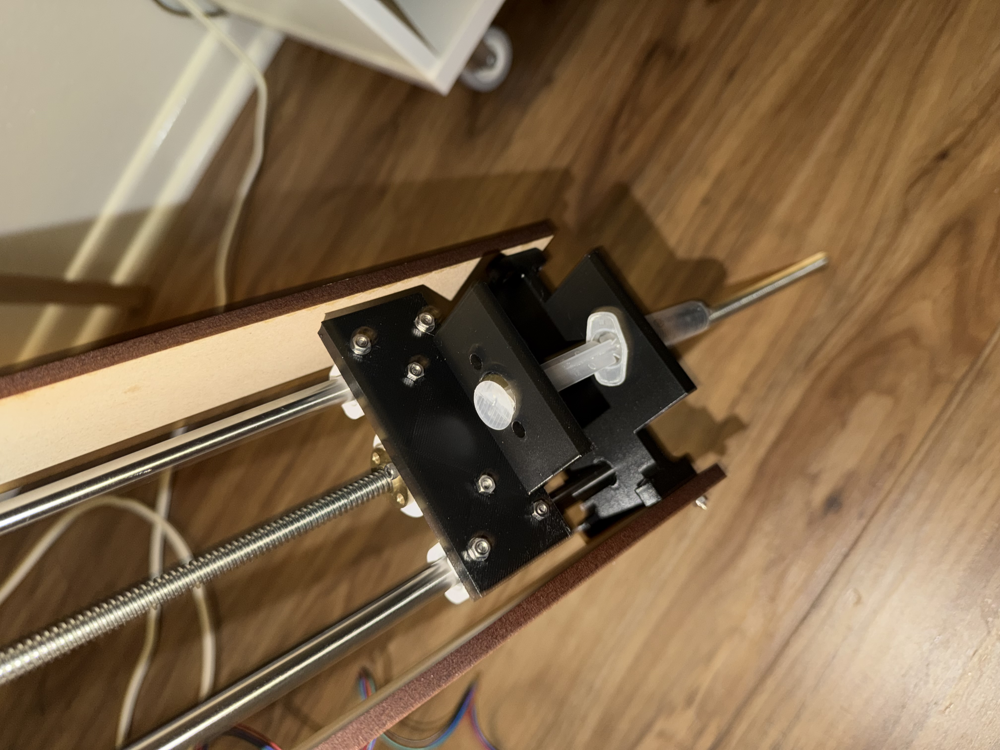
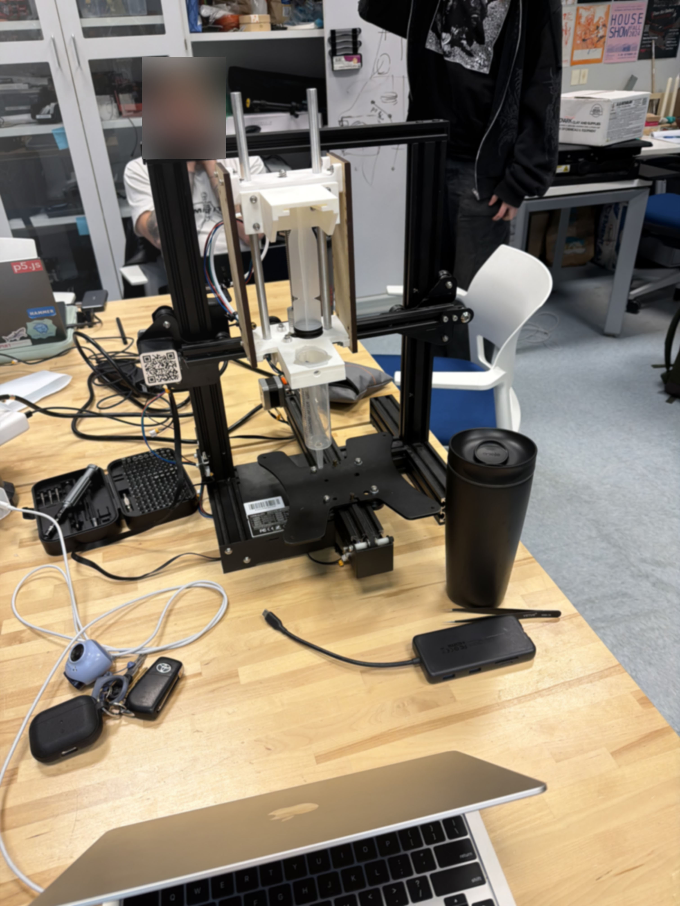

# Project 2: SlipDrip

## Overview

The aim of this project was to create a custom CNC machine that allows the user to create highly geometric designs for ceramic bisqueware via precise slip-dripping from an extruder mechanism. We accomplished this by modifying a Creality Ender 3, disassembling all parts except for the axes, and connecting it to a Stepdance board. To drip the slip glaze from the extruder, we utilized a syringe and push-down mechanism. Through Stepdance, the user is able to calibrate the device and define the extrusion rate, height of the extruder, and location of the extruder head.

## Material Testing

**Slip Creation**

We began by developing our slip formula. Recycled clay was broken down into progressively finer pieces and combined with water to produce a "mother slip," from which all subsequent slip batches were derived. We tested consistency by manually extruding the slip on a sponge, which successfully resulted in formation of well-defined, cohesive blobs.



**Pigmented Slip**

Next, we added pigment to our slips, using Cobalt Carbonate (Blue) and Copper Carbonate (Green).

We referenced this recipe: [The Ceramics Bible](https://www.amazon.com/Ceramics-Bible-Revised-Louisa-Taylor/dp/1797215140/ref=pd_sbs_d_sccl_1_1/141-1527759-0986908?pd_rd_w=jjKfE&content-id=amzn1.sym.aa738fbd-ad05-4d11-aae2-04b598db6305&pf_rd_p=aa738fbd-ad05-4d11-aae2-04b598db6305&pf_rd_r=1V6GF4VKX9VRSJRZJX1C&pd_rd_wg=zmXD8&pd_rd_r=c3bc12e0-6cf4-4827-a001-c66b4e96c542&pd_rd_i=1797215140&psc=1) by Louisa Taylor



Throughout the project, the slip would naturally dry out over time, so we continually adjusted the recipe — adding water or dried slip as needed — to maintain the appropriate consistency.

## Mechanism Design

We removed all unnecessary components from the Ender to maximize the available space for modifying the mechanism. From there, our primary focus was experimenting with different design approaches for extruding slip from the location previously occupied by the extrusion head.

**1. Modifying Instructor Example**

We began by examining the instructional model, studying its features to understand how it could be adapted into a design similar to [Constantijn](https://www.youtube.com/watch?v=Q3A4NqTPOYY).


**2. Syringe holder and pusher**

We developed a simple CAD design that used a small syringe to extrude slip. Once constructed, however, it became clear that we would need to accommodate a wider range of syringe sizes and implement a more reliable mechanism for pushing the plunger. This was our first iteration of the extruder:



**3. Creation of the Screw-In Mount**

**3. Syringe Mount**

Referencing our previous project using an AxiDraw plotter, we drew inspiration from its screw-in mechanism, which holds a pen or brush in place using a simple twist-and-tighten fitting for XY plotting. We adapted this same screw-in approach for our machine, but replaced the pen holder with a triangular cavity sized to hold a syringe barrel securely in place.

**4. Plunger Slot**

To actuate the syringe, we added a second triangular slot positioned above the screw-mounting plate. This slot holds the end of the plunger in place, allowing it to be pushed downward in a controlled, consistent motion as the mechanism drives it — dispensing the slip effectively.

**5. Weight Reduction**

Since our overall assembly was unnecessarily bulky, we replaced the steel rods with aluminum rods and substituted the original lead screw with a 150 mm lead screw.

Setting aside assembly, fitting, and other minor adjustments, we arrived at a final working design:




## Software Design

The software is built on Stepdance, a custom embedded library developed in this course. Rather than requiring coordinate input or code-level configuration, the system keeps all interaction physical — potentiometers, encoders, and buttons. Under the hood, motion is calculated in polar coordinates and converted to Cartesian internally, mapping onto the geometry of wheel-thrown artifacts. 

```cpp
KinematicsPolarToCartesian polar_kinematics;
polar_kinematics.output_x.map(&channel_a.input_target_position);
polar_kinematics.output_y.map(&channel_b.input_target_position);
```

This is the conceptual heart of the machine. Rather than commanding XY positions directly, the system processes polar coordinates (angle + radius) and converts to Cartesian internally. 


```cpp
button_d1.set_callback_on_press(&zeroingAxis);
time_based_interpolator.add_move(GLOBAL, 30.0, -214.49, -384.41,0,0,0,0);
```

One button press zeros the XY axis and moves to a known home position that is aligned with our physical extrude mechanism.

```cpp
drip_filter.set_ratio(dripRate, TWO_PI);
drip_filter.input.map(&polar_kinematics.input_angle);
drip_filter.output.map(&channel_e.input_target_position);
```

The glaze extrusion is coupled to the angle of rotation. This means dots are placed based on where the head is in the circle, not how long it's been running — ensuring even angular spacing regardless of speed variations.

```cpp
float64_t dripMultiplier = analog_a1.read();
drip_filter.set_ratio(dripRate * dripMultiplier, TWO_PI);
```

The drip rate is adjustable in real time via a physical potentiometer. This is the key usability feature, and it directly supports our non-CAD-CAM design goal.

```cpp
encoder_1.output.map(&polar_kinematics.input_radius);
encoder_2.output.map(&channel_z.input_target_position);
```

The radius and height aren't typed in, but rather set by physically turning encoders. Again, we utilize a gestural and hands-on approach rather than coordinate-entry.

The full source code for this project can be found [here](https://github.com/Creative-Motion-Control-Course/Team-Pancho/blob/main/projects/project2/code/polar_circle_gen_working/polar_circle_gen_working.ino).

## Interacting with SlipDrip

After refining how we envisioned user-interaction with our machine, we recognized that the process was more involved than expected and required clearer guidance. To address this, we developed a step-by-step set of instructions for operating the machine. We consulted with classmates to identify any gaps and revised accordingly. The result was the following set of instructions for using SlipDrip.

### Before Powering the System

1. Set Potentiometer 1 to 0 by turning it clockwise.
2. Set Potentiometer 2 to 0 by turning it counterclockwise.
3. Zero the X-axis by moving the extruder to the left-most side of the belt.
4. Zero the Y-axis by moving the print bed to the back of the printer.


### Calibrating the Printer

1. Power up the Stepdance board and send the program from your device.
2. Press the red button to send the X and Y axes to the "start" position.
3. Load the slip into the empty syringe until it hits the 7 mL mark.
4. Before inserting the syringe, ensure that the upper platform is around 70% of the height of the lead screw. To tune this height:
   - Press the Blue Button to incrementally raise the platform.
   - Turn Potentiometer 2 clockwise to lower the platform.
5. Fasten the syringe in the upper platform by sliding the end of the plunger into the triangular slit.
6. On the lower platform, tighten the screw clockwise to fix the syringe in place, ensuring that the needle is situated beneath the platform.

### Using the Ceramic Slip-Drip Printer

1. Center your ceramic bisqueware on the bat.
2. To fasten the bat onto the print bed, check these conditions:
   - The round pegs on the bed are aligned with the diagonal inner holes under the bat.
   - The square-shaped pegs sit flush between the grid lines under the bat.
3. Use the Encoder labeled R to set the desired radius of the slip pattern.
4. Use the Encoder labeled Z to adjust the z-axis height so that the syringe needle doesn't crash into the artifact.
5. Carefully turn Potentiometer 1 counterclockwise until the extruder drips.
6. When you are satisfied with the resulting pattern, turn the potentiometer back to 0 to halt the slip extrusion.


## Artifacts

The resulting artifacts encompassed a range of different slip patterns and different firing stages.
<!-- 


 -->

<div style="display: flex; flex-wrap: wrap; gap: 10px;">
  
  
  
  
  
</div>

## Challenges

- **User Interface:** the instruction manual is thorough, but this also makes the machine difficult to learn without prior instruction or help.

- **Slip Consistency:** the slip composition changed frequently and was never formulated precisely — it was made by feel rather than a fixed recipe.

- **Centering:** objects were not always perfectly circular, making precise centering impossible at times. Additionally, the center of the bat didn't always align with the center of the object itself.

- **Mechanism Accuracy:** making the slip extrusion rate a user-adjustable parameter was a necessity, since the slip required constant monitoring for changes in consistency, and it was difficult to know exactly where it was being applied.

## Future Prospects

- **Laser Pointer:** adding a laser to the extrude mechanism would make it clearer to the user whether the object is centered, and would alse ensure that the drops land where the user actually wants them to.

- **Refine Mechanism:** the mechanism itself needs to be reinforced, as it constantly needed to be checked for retightening and at one point required parts to be reprinted because they no longer worked as well.

- **UI Elements:** small adjustments, such as reversing the potentiometer direction so they turn the same direction could improve the user experience.


# Demo

<iframe width="560" height="315"
  src="https://www.youtube.com/embed/FSjkw4u0cYo"
  frameborder="0" allowfullscreen></iframe>


# Retrospective

## Interaction and Interface

### `Standard  ○────○────○────●────○  Custom` 

Does the machine necessitate a novel mechanism (or mechanisms) in any part of its functionality? Does it adapt existing mechanisms

Although it adapted from a ender, it was stripped down to its bare essentials and uses a custom mount and extruder mechanism.

### Walk Up and Use  ○────○────○────○────●  Requires Skill / Training

Would someone need to practice with the machine to use it effectively? Or is the interaction relatively controlled and constrained? What element of risk, if any does the machine introduce?

The need for an instruction and someone who knows the code of the machine means it is highly specialized .

## Mechanism

### Standard ○────○────○────●────○ Custom

Does the machine necessitate a novel mechanism (or mechanisms) in any part of its functionality? Does it adapt existing mechanisms?

The mechanism is adapted from the instructor model; however, the modifications to this model were heavy, and the size changed completely.

### Underengineered ○────○────●────○────○ Overengineered

What is the relationship between the amount of engineering complexity and the application? How robust is the mechanism and how many cycles of operation is it likely to withstand? What level of prototype is the mechanism? How might it be improved?

We ran multiple cycles and it was able to withstand a lot of wear and tear, so it could feasibly operate; however, this is a minimum viable product, as there is a lot to improve.

### Tool-like ●────○────○────○────○ Machine-like

How similar is the machine to an automated fabrication technology versus a manual tool?

It reminds me the most of a lathe, as it repeats the same motion, but the uses of that motion are entirely on the user to imagine.

## Artifacts

### Refined ○────○────●────○────○ Rough

What is the degree of craftsmanship of the artifacts?

The uncentered pieces, the small amount of glassware, and the lack of testing make these artifacts inherently rough, as they were produced on a faster timescale than most ceramics.

### Other Means ○────●────○────○────○ Only This Machine

Could the artifacts be produced by other means? If so, what would be involved? Does the machine reduce challenges or create new opportunities compared to other workflows for artifact production?

These highly geometric designs can be produced manually with a large amount of time and effort, measuring and slipping with great intention. This machine reduces the time and effort required, allowing for faster iteration compared to a manual workflow.

### Manual ●────○────○────○────○ Automatically Produced

How much of the artifact is produced through manual means vs automation? Where is the line drawn?

The only step that is automatically produced in our artifact-creation process is the dropping of the slip; the body, slip preparation, and glazing all rely on a human operator.

### Pre-planned ○────○────○────●────○ Determined During Fabrication

To what degree is the design of the artifacts determined/specified in advance of material interaction?

The body and more are all defined by the user in advance, but during the specific interaction the user is limited in that they can only make circles. However, the complete control offered through the user interface — the z-axis, extrusion rate, and radius — means that much of the motion is left to the user.
